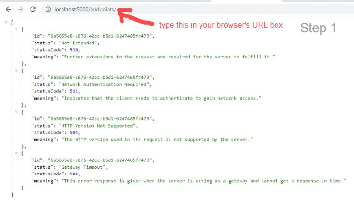
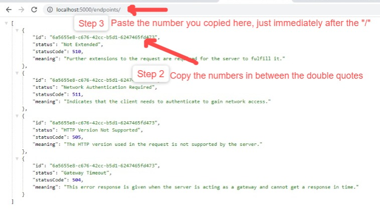
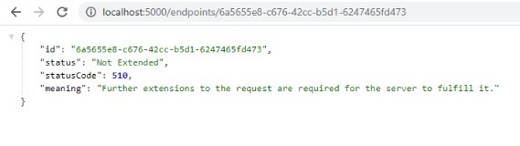

# Status Code Endpoints on Postman - Assignment 

**1. a. Why do we need status code?**

        An HTTP status code is a server response to a browser's request. When a website is visited, 
        the browser sends a request to the site's server, and the server then responds to the 
        browser's request with a three-digit code - the HTTP status code.

        Status and error codes refer to a code number in the response header that indicates 
        the general classification of the response — for example, whether the request was 
        successful (200), resulted in a server error (500), had authorization issues (403), 
        and so on.  
        
        
   **b.  Give 5 reasons for question 1. a.**
    
       1.  Status code defines the status of the request. On entering a URL, a mistake can be typed in the URL,
           or there may be a server-side problem. Status code is used to know about what went wrong and where you
           made a mistake.    
           
       2.  They help identify the cause of the problem when a web page or other resource do not load properly.
       
       3.  For example, the HTTP status line 500: Internal Server Error is made up of the HTTP status code of 
           500 and the HTTP reason phrase of Internal Server Error.
           
       4.  4xx Client Error: This group includes those where the request for a web page or other resource contains a
           bad syntax or cannot be filled for some other reason, presumably by the fault of the client (the web surfer).
           
       5.  5xx Server Error: This group includes those where the request for a web page or other resource is understood
           by the website's server, but is incapable of filling it for some reason.
           
           
   **c. List 10 of the most important error codes arranged in priorities**
           
        1.  Status Code 200 – This is the standard “OK” status code for a successful HTTP request. 
            The response that is returned is dependent on the request. For example, for a GET request, 
            the response will be included in the message body. For a PUT/POST request, the response will 
            include the resource that contains the result of the action.
            
        2.  Status Code 201 – This is the status code that confirms that the request was successful and, 
            as a result, a new resource was created. Typically, this is the status code that is sent after a POST/PUT request.
            
        3.  Status Code 204 – This status code confirms that the server has fulfilled the request but does not need to return 
            information. Examples of this status code include delete requests or if a request was sent via a form and the response
            should not cause the form to be refreshed or for a new page to load.
            
        4.  Status Code 304 – The is status code used for browser caching. If the response has not been modified, 
            the client/user can continue to use the same response/cached version. For example, a browser can request 
            if a resource has been modified since a specific time. If it hasn’t, the status code 304 is sent. If it has
            been modified, a status code 200 is sent, along with the resource.
            
       5.   Status Code 400 – The server cannot understand and process a request due to a client error. Missing data, 
            domain validation, and invalid formatting are some examples that cause the status code 400 to be sent.
            
       6.   Status Code 401 – This status code request occurs when authentication is required but has failed or not been provided.
      
       7.   Status Code 403 – Very similar to status code 401, a status code 403 happens when a valid request was sent, 
            but the server refuses to accept it. This happens if a client/user requires the necessary permission or they 
            may need an account to access the resource. Unlike a status code 401, authentication will not apply here.
            
       8.   Status Code 404 – The most common status code the average user will see. A status code 404 occurs when the
            request is valid, but the resource cannot be found on the server. Even though these are grouped in the Client
            Errors “bucket,” they are often due to improper URL redirection.
            
       9.   Status Code 409 – A status code 409 is sent when a request conflicts with the current state of the resource. 
            This is usually an issue with simultaneous updates, or versions, that conflict with one another.
            
      10.   Status Code 410 – Resource requested is no longer available and will not be available again. Learn about 
            network error 410.
            
      11.   Status Code 500 – Another one of the more commonly seen status codes by users, the 500 series codes 
            are similar to the 400 series codes in that they are true error codes. The status code 500 happens 
            when the server cannot fulfill a request due to an unexpected issue. Web developers typically have to 
            comb through the server logs to determine where the exact issue is coming from.
       
       
       
**2.  Create 20 endpoints using different status codes then add them to postman** 
      Please visit this link 👉 [link to 30 status code endpoints](./index.js) for the answer.
      
      
      

**3.  Write 5 differences between server-side error and client-side error (create an endpoint for this assignment 
      and write the answer inside your code. Call the endpoint assignment-three)** 
      Please visit this link 👉 [link to question 3](./index.js) for the answer.
      
      Client-Side Status Codes
      ------------------------
      The 4XX group of status codes is usually related to client-side errors, but changes to the API can also cause 
      them. Here are the 5 most common client-side status error codes and how to solve for them:
      
      
      1. 404 Not Found
      This is by far the most common HTTP status code you can get. It indicates that the URL you used in your request
      doesn’t exist on the API server, or origin server. While this is a 4XX error, which usually means something on 
      the client-side is wrong, this can also indicate a server problem. Sometimes API URL paths change after a version 
      update, but sometimes they change because something on the server went wrong.

      The best course of action is to check if you have a typo in your client code before checking if the API has issues.
      
      
      2. 401 Unauthorized
      This status code means you haven’t yet authenticated against the API. The API doesn’t know who you are and it will not
      serve you.

      For most APIs you need to sign up and get an API key. This key is then used inside an HTTP header field when you send
      a request, telling the API who you are.

      This http status code is similar to the less common 407 Proxy Authentication Required, which means you have not 
      authenticated with the proxy.

      3. 403 Forbidden
      The forbidden status indicates that you don’t have permission to request that URL. You’re authenticated, but the user 
      or role you’re authenticated for isn’t permitted to make the API request.

      This also occurs when you have an authentication issue, like when using the wrong API key or trying to access features
      your subscription plan doesn’t allow for.

      4. 400 Bad Request
      The 400 Bad Request error message is one of the most generic HTTP status codes. It implies that you did not correctly 
      format your API request. If no additional error information is given in the response body, you have to check the docs. 
      You could be missing a query, a field in the request body, or a header field could be wrong. It could also be that some 
      of your request data might have incorrect syntax.

      This is different from the 422 Unprocessable Entity error message, which appears when your request is correctly formatted, 
      but cannot be processed.
      
      
      5. 429 Too Many Requests
      Most API subscription plans have limits — the cheaper the plan, the fewer requests per second are allowed for your API key.

      If you’re sending too many requests in a short amount of time, consider throttling them in your client. This response can 
      also indicate that you hit a daily, weekly, or monthly limit on your account. Without implementing API analytics, it’s 
      possible to reach these limits without receiving a push notification or email alert.
      
      
      Server-Side Status Codes
      ------------------------
      The 5XX group of status codes usually return in response to a server error, but an invalid API call that should respond 
      with a 4XX can also return a 5XX error if not caught correctly on the server. Here are the 5 most common errors and how 
      to fix them:

      1. 500 Internal Server Error
      This HTTP status code can mean anything really, but it usually indicates the API server crashed. It could have been caused
      by something related to your API call.
      Double-check the docs to make sure you did everything right: query fields, body fields, headers, and format.
      If that didn’t fix the problem, it might also have been related to an API update that introduced buggy code, or data the 
      API loaded from an upstream service. In that case, your only cause of action is contacting the API’s support.

      
      2. 502 Bad Gateway
      This response tells you that the server you were calling wasn’t the actual API server, but a gateway or proxy. The proxy 
      server tries to call the API server in your name. This error response also indicates that the API server didn’t answer. 
      This could be related to a network problem, or simply because the API server crashed, or was down for maintenance.
      A “bad gateway” error is usually temporary and should be solved by the API provider, but you have to contact support if
      it persists.
      
      
      3. 503 Service Unavailable
      The 503 Service Unavailable Status indicates a server error. Too many API requests were sent and now the API can’t handle 
      any more of them. This problem solves itself when clients send fewer future requests, but it could also mean that the API
      provider didn’t plan enough resources for all of its customers.
      If it fits your use case, you can make your client more resilient to this error by waiting to send another request. But if 
      the error code keeps showing up, you have to contact the API provider.

      4. 504 Gateway Timed Out
      Like the 502 Bad Gateway status, this response code tells you that the server you were calling is a proxy for the real API 
      server. This time, the problem is the API server’s slow response.
      This could be related to high network latency between the proxy and the API server. It could also mean that the API server 
      takes too long to process your request.
      To solve this problem, check if your request’s content could be related to that timeout. If you are requesting too much data
      or a calculation that takes too long, you should try and reduce it.
      If you think your request is reasonable and the status doesn’t go away, contact support.

      5. 501 Not Implemented
      The 501 Not Implemented status code is related to the HTTP method you used to request an URL. You can try a different HTTP
      method to make the request.

      Usually, an HTTP request with an inappropriate method simply results in a 404 not found status. A not-implemented status 
      implies that the method isn’t implemented “yet.” The API creator can use this status to tell the clients that this method 
      will be available to them in future requests.

**4.  Tell the code the difference you want to see in question 3** 
      Please visit this link 👉 [link to question 4](./index.js) for the answer.
  
  
**5.  Use GET by ID in another endpoint** 
      Please visit this link 👉 [link to question 5](./index.js) for the answer. 
      
Please follow these steps to fetch the endpoints by their IDs: 

    
      
  
  
